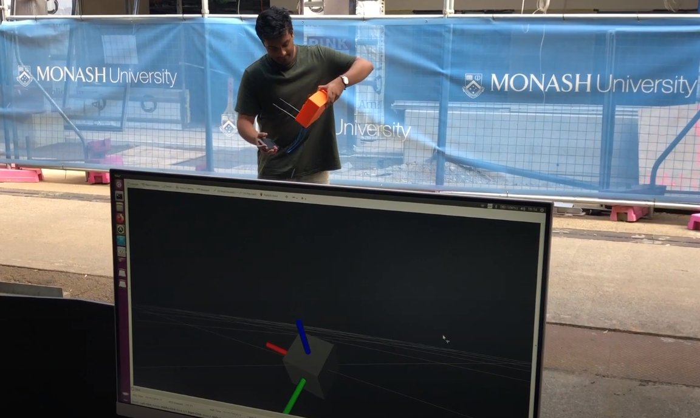

# Box Republisher

This package reads sensor data over Serial and republishes it as the corresponding ROS message.

Currently supports:

- Imu
- Magnetic Field
- IMU Calibration Data
- GPS (Latitude, Longitude, Altitude)

It requires an Arduino connected over USB Serial with `box_sensor_raw/box_sensor_raw.ino` uploaded to it.

To run the main node:

`python run_box_republisher.py`

Options:

- -port: select the arduino serial port name (default: /dev/ttyACM0)

- -baud: select the arduino serial baud rate (default: 115200)

Publishes:

- /imu: raw imu data including fused orientation, linear_acceleration and angular_velocity
- /imu/mag: raw imu magnetometer data
- /imu/calibration: status information indicating the state of the onboard calibration
- /gps: gps fix information including latitude, longitude, and altitude

To view in RVIZ:

`rviz -d cam_imu.rviz`

# Calibration UI
The `box_ui.py` python file is a node that displays the calibration status of the IMU.