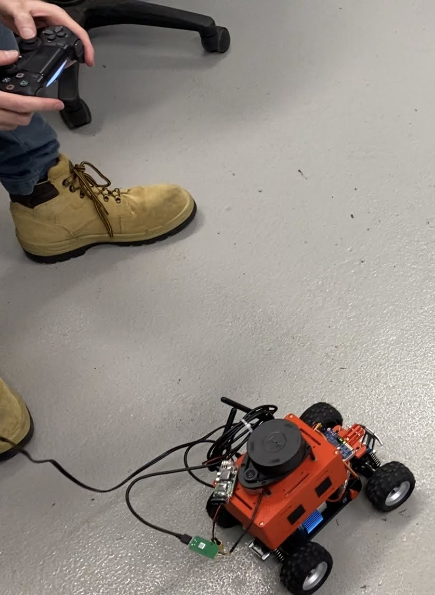

# Control
This package controls the vehicle's motors based on the desired ROS Twist message.
It listens for ROS Twist messages and sets the motor speed and servo position accordingly. It also provides a mapping from a connected joy stick controller to Twist messages.

Supports
- PS4 controller

To run the control node by itself:

`rosrun control control.py`

To run the control node as well as the joy stick controller twist publisher:

`roslaunch control dualshock.launch`